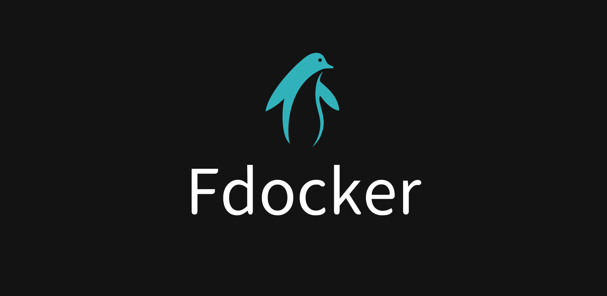
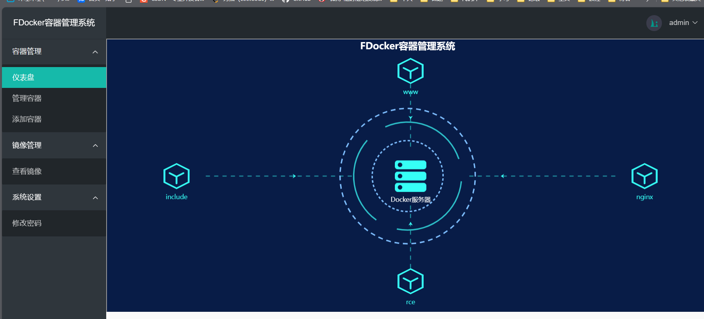
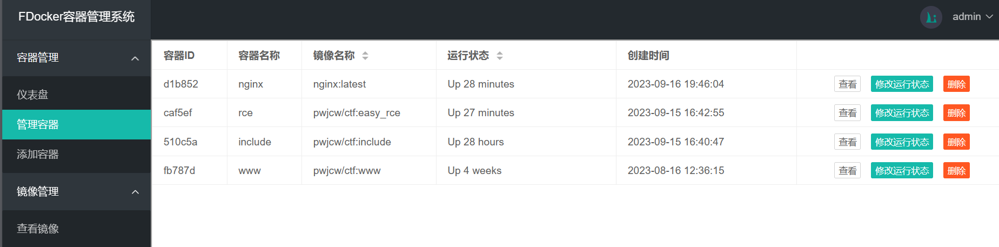
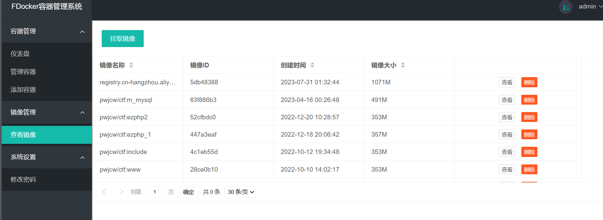

## 简介

​	FDocker意为(FDocker)，用于可视化操作Docker服务，快速创建Dcoker容器，拉取Docker镜像，代码通过com.github.dockerjava包的调用，通过Docker Remote Api控制Docker服务。

在使用该系统的前提是在服务器端以及开启了Docker远程Api，如未开启可以参考：http://t.csdn.cn/uIteh，并且在resource/docker目录下存放你的密钥文件。

项目涉及的技术栈有：

- Servlet

- Mybatis

- Layui

- Vue2

- Echarts

项目默认账户：admin/123465

## 项目部分截图

